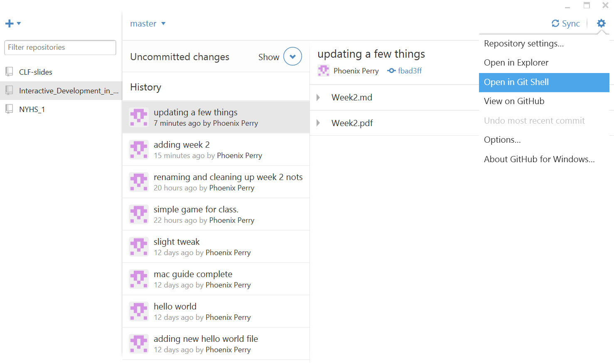
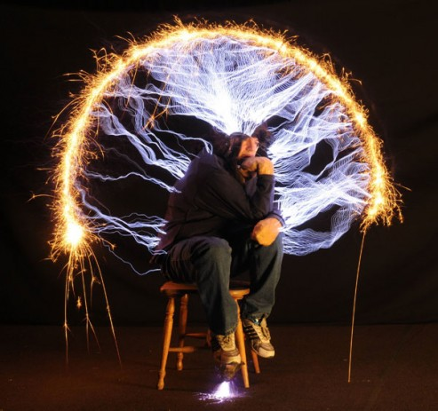
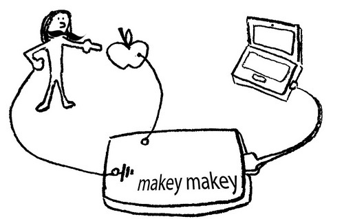

#Week 2 

*****************************************************
***Homework:***

1. Create a game controller for the Makey Makey for a small little game you make up. Note that in this guide I show you how to use images and sound for added fun. As I mentioned in class, my Makey Makey is on the edge of my desk in the Games and Interaction lab if you want to test your interface. Also, there's a rumor you can check them out but I do not know if it's true. If your  laptop's arrows, mouse, space bar and click work in your game, they will work with the Makey Makey. We will try them out in class. Do not remove my hardware from the lab please and return it to my desk when you are done. It's my personal equipment, not HKU's. The code for this week is in the week 2 folder at the root of this repository. <https://github.com/phoenixperry/Interactive_Development_in_Open_Frameworks> 	

2. Read chapter 1 of Playful Design by John Ferrara

3. Check out our designer of the week: Bora Yoon 
 <http://borayoon.com/> Bora uses everyday objects in her music. Pay careful attention to how she combines sound and visualization

###Open Frameworks projects and your homework. 
To create a project in this class, we will be using the project generator. You can find this in your open frameworks folder in the project generator folder. Run the application that's in there to create projects. 

**Make a project for your homework and call it week2 please. 
**
*****************************************************

Do you want to get my code without re-downloading the repository? You can! 

On windows make sure you are in the right repository on the right side of your screen (Interactive_Development_in_Open_Frameworks) and click on the gear icon. Choose Open in Git Shell 

Now in the command prompt type `git pull` and press enter 
 

Watch as it pulls down my files. DONE! How cool was that? 

You can do this on the mac to so give it a go!

Because I only briefly mentioned it in class, I want to tell you how the Makey Makey is working. As it turns out you are able to conduct energy over your skin. It just travels over you. Freaky! Congratulations, you're conductive!  

As it turn out, you are pretty resistant to electrical current. In fact, everyone has a slightly different resistance and the outside of your body has a different resistance than the inside of it. 

What is resistance? It is exactly what it sounds like. If something has resistance, it resists the flow of current, slowing it down or stopping it all together if the power is not strong enough to overcome it. This is why it takes quite a bit of power to shock you and if you touch the negative and positive bits of a battery, you don't get a shock. You slow the power down so much there's very little of it left by the time it conducts across you. You don't feel it.

 

Makey makey can detect very small amounts of current and hence can be used with resistant materials that are still a bit conductive. Some materials simply will not work and it's because their resistance is too high. When you complete the circuit by touching the power source and the ground, you complete the circuit and the current just flows over you, even though you don't feel it because it's so weak.
 

(image pulled from Makey Makey!) 

You can also reprogram the Makey (NO REPROGRAMMING MINE!) 
<https://learn.sparkfun.com/tutorials/makey-makey-advanced-guide> 

Also, you can hack your Makey Makey to not need a ground at all. You can hack it! 
<http://www.makeymakey.com/forums/index.php?topic=1267.0> 

