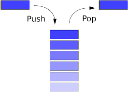

#Week 5 

### Memory management part 2! 
Today we're going to talk about
* The stack and the heap 
* pointers and references.

###Homework: 
read section 6 of learncpp.com and do all of the examples for yourself. 
<http://www.learncpp.com/> 

##Stack vs Heap

So far we have seen how to declare basic type variables such as int, double, etc, and complex types such as arrays and structs.

###The Stack

What is the stack? It's a special region of your computer's memory that stores temporary variables created by each function (including the main() function).

 The stack is a "FILO" (first in, last out) data structure, that is managed and optimized by the CPU quite closely. 
 
 Every time a function declares a new variable, it is "pushed" onto the stack. Then every time a function exits, all of the variables pushed onto the stack by that function, are freed (that is to say, they are deleted). Once a stack variable is freed, that region of memory becomes available for other stack variables.

The advantage of using the stack to store variables, is that memory is managed for you. You don't have to allocate memory by hand, or free it once you don't need it any more. What's more, because the CPU organizes stack memory so efficiently, reading from and writing to stack variables is very fast.

A key to understanding the stack is the notion that when a function exits, all of its variables are popped off of the stack (and hence lost forever). Thus stack variables are local in nature. This is related to a concept we saw earlier known as variable scope, or local vs global variables. A common bug in C programming is attempting to access a variable that was created on the stack inside some function, from a place in your program outside of that function (i.e. after that function has exited).

Another feature of the stack to keep in mind, is that there is a limit (varies with OS) on the size of variables that can be store on the stack. This is not the case for variables allocated on the heap.

To summarize the stack:

the stack grows and shrinks as functions push and pop local variables
there is no need to manage the memory yourself, variables are allocated and freed automatically
the stack has size limits
stack variables only exist while the function that created them, is running

###The Heap

The heap is a region of your computer's memory that is not managed automatically for you, and is not as tightly managed by the CPU. It is a more free-floating region of memory (and is larger). 

#####To allocate to the heap in C++ you use the keyword new 
#####To deallocate an element from the heap use delete. 

Let's look an emample of doing this with a class we define called Retangle: 
		

        class rectangle {
       		public:
            rectangle();
            void draw();
            void interpolateByPct(float myPct);
            ofPoint		pos;
            ofPoint		posa;
            ofPoint		posb;
            float		pct;	// what pct are we between "a" and "b"
            float		shaper;
		};
		
		void ofApp::setup(){
			Rec
		
		}

Once you have allocated memory on the heap, you are responsible for using free() to deallocate that memory once you don't need it any more. If you fail to do this, your program will have what is known as a memory leak. 

Unlike the stack, the heap does not have size restrictions on variable size (apart from the obvious physical limitations of your computer). Heap memory is slightly slower to be read from and written to, because one has to use pointers to access memory on the heap. We will talk about pointers shortly.

Unlike the stack, variables created on the heap are accessible by any function, anywhere in your program. Heap variables are essentially global in scope.

###Stack vs Heap Pros and Cons

####Stack

* very fast access
* don't have to explicitly de-allocate variables
* space is managed efficiently by CPU, memory will not become fragmented
* local variables only
* limit on stack size (OS-dependent)
* variables cannot be resized

#####Heap

* variables can be accessed from anywhere
* no limit on memory size
* (relatively) slower access
* no guaranteed efficient use of space, memory may become fragmented over time as blocks of memory are allocated, then freed
* you must manage memory (you're in charge of allocating and deleting variables)
* vectors are allocated on the heap, as is anything created with the keyword *new*

When to use the Heap?

When should you use the heap, and when should you use the stack? 

If you need to allocate a large block of memory (e.g. a large array, or a big struct), and you need to keep that variable around a long time, then you should allocate it on the heap. 

If you are dealing with  small variables that only need to persist as long as the function using them is alive, then you should use the stack.  

If you need variables like arrays and structs that can change size dynamically (e.g. arrays that can grow or shrink as needed) then you will likely need to allocate them on the heap, and use dynamic memory allocation functions 
(MORE ON THIS SOON!) 

### Pointers 

A pointer is a variable that holds the address of another variable.


        int *pnPtr; //a pointer to an int
        int* pnPtr; //also valid
        int * pnPtr; //also valid.
        //use whichever method makes sense to you.

• You can think of pointers as the address of your house. The address itself is justan address but it does tell someone how to come and find you.

• Pointers are addresses to objects - in this case your object would be your house.

 

####Here’s an example of how they work:

        int nValue = 5;
        int *pnPtr = &nValue;
        //assign address of nValue to pnPtr.
        
note: the * sign does not mean multiplication.
to get the address of a variable we can use the & (address-of operator) 
        

    int nValue = 5;
    int *pnPtr = &nValue;
    //assign the address of nValue to a pointer
    cout << &nValue << endl;
    //print the address of variable nValue;
    //0012FF7C would be the output (or similar) 
    cout << pnPtr << endl;
    //print the address that the pointer is holding
    // 0012FF7C would be the output. (or similar) 

** They are the same. Pointers much match the type of what they are
pointing at.**
 

##Dereferencing operator 
####The other operator you need to know about is *

You can dereference a pointer to access the object it is pointing at.

        int nValue = 5;
        cout << &nValue;
        //prints out the address of nValue
        cout << nValue;
        //prints out the value stored in nValue
        int *pnPtr = &nValue;
        //assigns the address of nValue to the new pointer pnPtr
        cout << pnPtr
        //prints out the address value
        cout << *pnPtr
        //prints out the value at the address
        
### Pointers can also be assigned and reassigned

        int nValue1 = 5;
        int nValue2 = 10;
        int *pnPtr;
        pnPtr = &nValue1;
        cout << *pnPtr //prints out 5
        pnPtr = &nValue2;
        cout << *pnPtr //prints out 10
###Null Pointers
You can set a pointer to = 0 when they are made. This is a really good practice
to get into that will save you pain later. 
Never deference a null pointer. It will be very, very bad.

`int *pnPtr = 0;`

Note the size of a pointer is dependent on a computer’s architecture, not on what it
pointing at. They are all the same size. In a 64bit that is an 8bytes address. In a 32bit
machine it’s 4bytes.

*Another way to think about it...
*

Pointers allow you to pass by reference, which means you pass the thing itself into a function. Just like references, this saves memory in a computer, particularly when dealing with large objects. In fact, a reference is a pointer that’s simplicity deferenced.

###And now for what is behind the curtain. 
Many things in oF are just classes you'll be creating instances of. 
Many things in oF (listeners) require references and you need to understand how to use them

