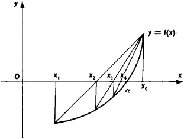

#Week 6 

Topics: Listeners, pointers and Lerping. 

**Note the homework assignment is at the end of this set of notes**

###Using Arduino with listeners. 
So far we have used Arduino in an inefficient way. This method has been depreciated in the offical Arduino spec and we are going to update to the proper way to implement the code today. 

This requires 2 things: 
	
**1. Listners 
**

We are going to listen in our code to for the arduino to make a connection with open frameworks. We have been using listeners since the first day of class. Listeners are checks to see if an event has occured within our application. Some of the post common are key pressed and mouse clicks. Open Frameworks establishes them for you behind the scenes and fires the functions for each event appropriately. 

Take for example, the oF keyPressed function. It is fired when you press a key
	
	
	void ofApp::keyPressed(int key){
		//int key is the value of the key pressed. 
		cout << key << endl; 
	}

This is all well and good but to turn on the listener for Arduino, we need to do it manually. 

Let's get started! First, add these lines of code to ofApp.h
		
    ofArduino ard;
    void setupArd(const int &version);
    	
    	

Now, of ofApp.cpp let's add this code: 

    void ofApp::setup(){
    /* note: this should be your usb port - on windows it will be a com port and possibly need a number here -- I'm researching for you currently */ 
      
 	//the first line of code here tells arduino to connect to a port at a baud rate. 
       ard.connect("/dev/tty.usbmodem1421", 57600);
            
	/*this second line of code adds the listener to oF. It checks every frame to see if an event called EInitialized has fired. It also needs to know what object the event should be attached to. The keyword this in programming is a pointer to the current object, in this case, the ofApp class. Next, it wants to know what function to run when the event occurs. We tell it to fire the function setupArd in the ofApp class.*/
	
	   ofAddListener(ard.EInitialized, this, &ofApp::setupArd);
	}

##What the hell is *this*

Ok - I've seen *this* confuse the everloving bejesus out of students over the years. Don't panic - I know it's weird. Just be glad we're not in javascript because this is so confusing even seasoned devs have a hard time knowing what it's referencing. 

> "Every object in C++ has access to its own address through an important pointer called this pointer. The this pointer is an implicit parameter to all member functions. Therefore, inside a member function, this may be used to refer to the invoking object."

In our case above, the ofApp object that is created by open frameworks for you. If you made a class called Pet and an instance of it called Tiny, tiny would be an object of type Pet. If you used this inside one of Tiny's member functions, it would refer to her. Tiny is very cute by the way and I'm horribly in love with her. I propose marriage daily. 

Let's see how the code for that would look:
 
    #include <iostream>
    using namespace std;
    class Pet{
    public:
        Pet(){}
        int age =0;
        void growOlder(){
            this->age +=1;
        }
    };
    
    int main(int argc, const char * argv[]) {
        Pet tiny;
        cout << tiny.age << " is Tiny's age when the app starts" << endl;
        tiny.growOlder();
        cout << tiny.age << " is Tiny's age after calling the member function growOlder" << endl;
        return 0;
    
    }

Still want more? Read the site where the above quote is from. <http://www.tutorialspoint.com/cplusplus/cpp_this_pointer.htm>

Now that we have this out of the way, what the heck is that & doing in front of ofApp? `ofAddListener(ard.EInitialized, this, &ofApp::setupArd);`

Let's go back for a sec to our conversation about pointers. 
All classes return pointers on the heap when they are instantiated right? So if we want to pass a reference to an object's member function, we can do it like that. That's all we are doing - sending a reference to the function setupArd in the ofApp object. :) 

Yeah! That's the first step. 

Once the event occurs, you'll want to get it out of memory. Events are expensive as the application is always performing an operation to check if they have occurred. Once they have, remove them. Let's look at doing that now in ofApp.cpp 

	void ofApp::setupArd(const int &version)
	{
       	 ofRemoveListener(ard.EInitialized, this, &ofApp::setupArd);
       	 ard.sendDigitalPinMode(9, ARD_OUTPUT);
       	 cout << version << " this is what the ard.EInitialized" << endl;
        
    }

Note it's the same procedure just a different function call as adding one. Then, set up the pin modes, in this case a digital pin and you're ready to rock and roll. 

Now that's done, let's make sure the arduino is updated every frame: 

	void ofApp::update(){
	    ard.update(); 
	}

And for this example, when a key is pressed, let's change an LED. 

	void ofApp::keyPressed(int key){
	        ard.sendDigital(9, ARD_HIGH);
    
	}

All of this code is living in `Week6_digitalPorts` here: 
<https://github.com/phoenixperry/Interactive_Development_in_Open_Frameworks/tree/master/Week6_digitalPorts>

There are also examples for Analog pins too! Check them out here: 
<https://github.com/phoenixperry/Interactive_Development_in_Open_Frameworks/tree/master/Week6_digitalPorts>

##But I want to make things move!! 
Yeah! All of that was horrifically dull. I'm like so bored right now. Let's make something move! 

####Lerping is awesome. 
Lerping is making objects on screen appear to move more naturally. For example, perhaps we start out slow, speed up and then slow down before we reach our target. We are doing to do this now! 

Open up the project called `Week6_Lerp_Homework` on github. 
<https://github.com/phoenixperry/Interactive_Development_in_Open_Frameworks/tree/master/Week6_Lerp_Homework>

I've commented this code heavily. Read it now and try it for yourself. 

Note there is a commented out additional thing you can do with a group of circles! Up to you if you want to try it second after you get a SINGLE thing actually lerping. 

What does lerp stand for? Linear Interpolation 

> It is a method of approximating the roots of a transcendental or algebraic equation f(x) = 0.
> 
> The essence of the method of linear interpolation consists in the following. Starting with two values x0 and x1 that are close to the root α and at which the values of the function f(x) have opposite signs, we take as the next approximate value x2 of the root α the point of intersection of the line passing through the points (x0, f(x0)) and (x1, f(x1)) and the x-axis (see Figure 1).

<http://encyclopedia2.thefreedictionary.com/Lerp+%28computing%29>

>  
 

This is one of those times where math should just be shown as code because it's a whole ton easier to understand. Go try the code for yourself. Print out the values -- it will make sense. Promise this is one of those things that looks way scarier than it actually is. You just slowly go between one value to another through in a very simple line of code. 

####Assignment: 
Right now you'll note the green box only moves down and then restarts. 
Your homework is to make is lerp back to it's original starting position verses jump back. 

